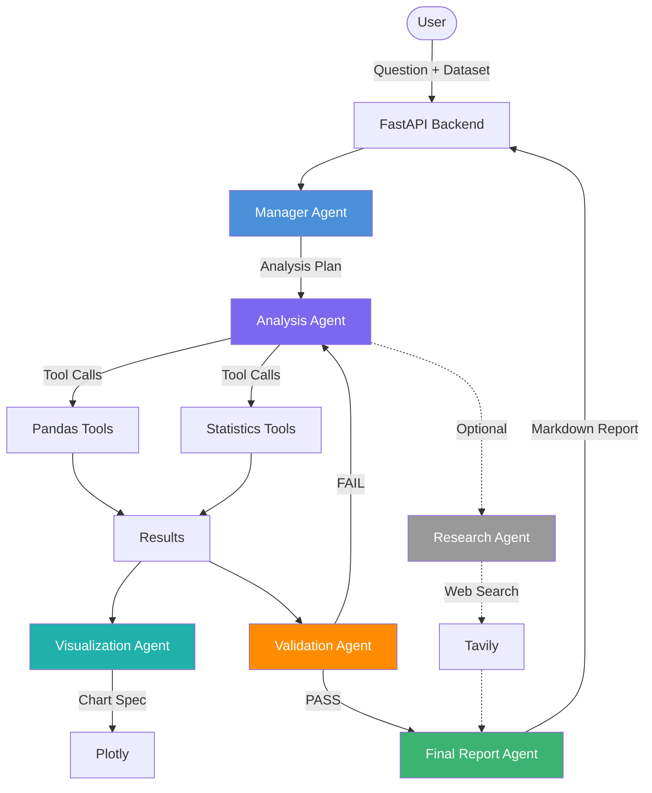

# AI Data Analyst Agent

> A production-quality, multi-agent AI data analysis platform built with FastAPI, LangGraph, Pandas, Redis, and MySQL.

[](https://python.org)
[](https://fastapi.tiangolo.com)
[](https://langchain-ai.github.io/langgraph/)
[](LICENSE)

---

## 📌 Project Overview

Upload a CSV/Excel file, ask a natural-language question, and watch a coordinated team of AI agents:

1. **Profile** the dataset automatically
2. **Plan** an analysis workflow
3. **Execute** deterministic Pandas/statistical operations
4. **Visualise** results with Plotly
5. **Validate** correctness
6. **Report** findings in plain English
7. Optionally **research** external factors with Tavily

> **Resume description:** "Built a multi-agent AI data analysis platform using FastAPI, LangGraph, Pandas, Redis and MySQL that autonomously plans analytical workflows, invokes deterministic data-processing tools, generates visualizations, validates results, and optionally performs external research using Tavily."

---

## 🏗️ Architecture



---

## ✨ Features

| Feature | Status |
|---|---|
| CSV / Excel upload | ✅ Phase 1 |
| Dataset profiling | ✅ Phase 1 |
| Deterministic Pandas analysis tools | ✅ Phase 1 |
| LLM-powered tool selection (Gemini / Groq) | ✅ Phase 2 |
| LangGraph multi-agent workflow | ✅ Phase 3 |
| Plotly visualizations | ✅ Phase 4 |
| FastAPI REST API | ✅ Phase 5 |
| MySQL persistence | ✅ Phase 6 |
| Redis caching | ✅ Phase 7 |
| React dashboard (glassmorphism + Three.js) | ✅ Phase 8 |
| Tavily web research | ✅ Phase 9 |
| JWT authentication | ✅ Phase 10 |
| Docker / Docker Compose | ✅ Phase 11 |
| Pytest test suite (72 tests) | ✅ Phase 12 |
| GitHub Actions CI/CD | ✅ Phase 13 |

---

## 🤖 Agent Workflow

```
User Question
     │
     ▼
Manager Agent
  • Understands intent
  • Inspects dataset profile
  • Creates analysis plan
     │
     ▼
Analysis Agent
  • Selects tools from plan
  • Calls Pandas/Stats tools
  • Observes results
     │
     ▼
Visualization Agent
  • Decides if chart is useful
  • Specifies chart parameters
  • Plotly generates chart
     │
     ▼
Validation Agent
  • Verifies columns exist
  • Checks calculation consistency
  • Confirms conclusion is supported
     │ (FAIL → back to Analysis Agent, max 3 retries)
     ▼
Final Report Agent
  • Formats business-friendly answer
  • Cites sources (data + web)
  • Produces: Summary, Findings, Charts, Recommendations
```

---

## 🛠️ Tech Stack

| Layer | Technology |
|---|---|
| **Backend** | Python 3.11+, FastAPI, Pydantic |
| **Agent Framework** | LangGraph, LangChain |
| **LLM** | Google Gemini 1.5 Flash |
| **Data Analysis** | Pandas, NumPy, SciPy |
| **Visualization** | Plotly |
| **Database** | MySQL + SQLAlchemy + Alembic |
| **Cache** | Redis |
| **Frontend** | React + Vite + Tailwind CSS |
| **Auth** | JWT (python-jose) |
| **Search** | Tavily Web Research API |
| **Container** | Docker + Docker Compose |
| **CI/CD** | GitHub Actions |

---

## 📁 Project Structure

```
ai-data-analyst/
├── .github/workflows/
│   └── ci.yml                       # GitHub Actions CI (Phase 13)
├── backend/
│   ├── app/
│   │   ├── main.py                  # FastAPI entry point (Phase 5)
│   │   ├── core/
│   │   │   ├── config.py            # Settings & environment config (Phase 5)
│   │   │   ├── security.py          # JWT & bcrypt utilities (Phase 10)
│   │   │   └── dependencies.py      # Auth dependency guard (Phase 10)
│   │   ├── profiler/
│   │   │   └── data_profiler.py     # Dataset auto-profiler (Phase 1)
│   │   ├── tools/
│   │   │   ├── pandas_tools.py      # 15+ deterministic Pandas tools (Phase 1)
│   │   │   ├── statistics_tools.py  # Statistical analysis tools (Phase 1)
│   │   │   ├── visualization_tools.py  # Plotly chart generation (Phase 4)
│   │   │   └── research_tools.py    # Tavily web search tool (Phase 9)
│   │   ├── services/
│   │   │   ├── llm_service.py       # LLM routing: Gemini/Groq + tool schema (Phase 2)
│   │   │   ├── agent_service.py     # LangGraph StateGraph workflow (Phase 3)
│   │   │   ├── cache_service.py     # Redis cache layer (Phase 7)
│   │   │   ├── job_service.py       # Async job tracking in Redis (Phase 7)
│   │   │   └── cleanup_service.py   # Background 4-hour data purge (Phase 7)
│   │   ├── api/v1/
│   │   │   ├── auth.py              # /register /login /me endpoints (Phase 10)
│   │   │   ├── datasets.py          # Upload & profile endpoints (Phase 5)
│   │   │   └── analysis.py          # Sync/async query endpoints (Phase 5)
│   │   ├── models/
│   │   │   ├── dataset.py           # Dataset SQLAlchemy model (Phase 6)
│   │   │   ├── analysis_run.py      # Query log SQLAlchemy model (Phase 6)
│   │   │   └── user.py              # User SQLAlchemy model (Phase 10)
│   │   ├── schemas/
│   │   │   ├── dataset_schemas.py   # Upload/profile Pydantic schemas
│   │   │   ├── analysis_schemas.py  # Query request/response schemas
│   │   │   └── auth_schemas.py      # Register/login/token schemas (Phase 10)
│   │   └── database/
│   │       └── connection.py        # MySQL engine + SQLite fallback (Phase 6)
│   ├── tests/                       # 72 passing unit/integration tests (Phase 12)
│   │   ├── test_agent.py            # LangGraph workflow tests
│   │   ├── test_api.py              # REST API endpoint tests
│   │   ├── test_auth.py             # JWT auth flow tests
│   │   ├── test_cache.py            # Redis cache & async job tests
│   │   ├── test_database.py         # ORM persistence & cleanup tests
│   │   ├── test_llm_service.py      # LLM routing & mock tests
│   │   ├── test_pandas_tools.py     # All pandas tool unit tests
│   │   ├── test_research.py         # Tavily research tool tests
│   │   └── test_visualization.py    # Plotly chart tool tests
│   ├── Dockerfile                   # Python 3.12-slim container (Phase 11)
│   └── requirements.txt
├── frontend/                        # React 18 + Vite glassmorphism SPA (Phase 8)
│   ├── src/
│   │   ├── api/client.js            # Axios client + JWT interceptors (Phase 10)
│   │   ├── pages/
│   │   │   ├── LandingPage.jsx      # Upload entry page
│   │   │   ├── DashboardPage.jsx    # 3-panel analysis workspace
│   │   │   └── AuthPage.jsx         # Login / Register page (Phase 10)
│   │   └── components/
│   │       ├── ParticleBackground   # Three.js WebGL particle scene
│   │       ├── UploadZone           # Drag-and-drop CSV/Excel upload
│   │       ├── ProfileSidebar       # Dataset column & type metadata
│   │       ├── ChatPanel            # NL query chat interface
│   │       ├── ChartViewer          # Plotly chart image viewer
│   │       ├── SessionTimer         # 4-hour auto-delete countdown
│   │       ├── MessageBubble        # Chat bubble with result formatting
│   │       └── DownloadBar          # CSV / chart / JSON export bar
│   ├── nginx.conf                   # SPA router + API reverse proxy (Phase 11)
│   └── Dockerfile                   # Multi-stage Node→Nginx build (Phase 11)
├── data/
│   ├── generate_dataset.py          # Synthetic sales data generator
│   └── sales.csv                    # Sample dataset (50k rows)
├── cli.py                           # Phase 1 standalone CLI entry point
├── docker-compose.yml               # 4-service orchestration (Phase 11)
├── .env.example                     # Environment variable template
├── .gitignore
└── README.md
```

---

## ⚙️ Installation

### Prerequisites

- Python 3.11+
- Git

### Step 1: Clone

```bash
git clone https://github.com/yourusername/ai-data-analyst.git
cd ai-data-analyst
```

### Step 2: Virtual Environment

```bash
python -m venv .venv

# Windows
.venv\Scripts\activate

# macOS / Linux
source .venv/bin/activate
```

### Step 3: Install Dependencies

```bash
pip install -r backend/requirements.txt
```

### Step 4: Environment Variables

```bash
cp .env.example .env
# Edit .env — Phase 1 needs NO API keys
```

### Step 5: Generate Dataset

```bash
python data/generate_dataset.py
```

---

## 🚀 Running Locally

### Option A — Docker Compose (Recommended)

```bash
# 1. Copy and edit environment variables
cp .env.example .env

# 2. Build and start all 4 services
docker compose up --build -d

# 3. Open browser
# Frontend:  http://localhost:3000
# API Docs:  http://localhost:8000/docs
```

### Option B — Local Development

#### Phase 1 — CLI

```bash
python cli.py
# or
python cli.py --file data/sales.csv
```

#### Phase 5+ — API Server

```bash
uvicorn backend.app.main:app --reload --host 0.0.0.0 --port 8000
```

#### Phase 8+ — Frontend Dev Server

```bash
cd frontend
npm install
npm run dev
```

### Option C — One-Click Windows Launcher (`run.bat`)

Simply double-click `run.bat` or run from terminal:

```cmd
run.bat
```

This automatically launches both the FastAPI backend and React frontend services and opens [http://127.0.0.1:5173/](http://127.0.0.1:5173/) in your default browser.


---

## 📊 Example Questions

### Basic
```
total sales
average profit
max quantity
describe sales
```

### Grouping
```
top 5 region by profit
top 3 category by sales
group category by profit mean
```

### Time Series
```
monthly sales
quarterly profit
changes sales
compare 2023-02 2023-03 sales
```

### Statistical
```
correlate sales profit
correlations
outliers profit
outliers discount
describe profit
```

### (Phase 2+) Natural Language
```
Why did sales decrease in March?
Which region is underperforming?
What are the top factors affecting profit?
Find unusual transactions.
```

---

## 🧪 Testing

```bash
# Run all tests
pytest backend/tests/ -v

# Run specific test class
pytest backend/tests/test_pandas_tools.py::TestGroupBy -v

# Run with coverage
pytest backend/tests/ --cov=backend/app --cov-report=html
```

---

## 🌍 Environment Variables

See [.env.example](.env.example) for all variables.

| Variable | Required | Phase | Description |
|---|---|---|---|
| `LLM_API_KEY` | Phase 2+ | 2 | Google Gemini API key |
| `TAVILY_API_KEY` | Optional | 9 | Tavily web research key |
| `MYSQL_*` | Phase 6+ | 6 | MySQL connection details |
| `REDIS_*` | Phase 7+ | 7 | Redis connection details |
| `SECRET_KEY` | Phase 10+ | 10 | JWT signing secret |

---

## 🔮 Development Phases

| Phase | Description | Status |
|---|---|---|
| 1 | CLI + Pandas tools + Dataset profiler | ✅ Complete |
| 2 | LLM + Tool calling (Gemini / Groq) | ✅ Complete |
| 3 | LangGraph multi-agent workflow | ✅ Complete |
| 4 | Visualization Agent + Plotly | ✅ Complete |
| 5 | FastAPI REST API | ✅ Complete |
| 6 | MySQL + SQLAlchemy + SQLite fallback | ✅ Complete |
| 7 | Redis caching + async job state | ✅ Complete |
| 8 | React + Vite glassmorphism dashboard | ✅ Complete |
| 9 | Tavily Research Agent | ✅ Complete |
| 10 | JWT Authentication | ✅ Complete |
| 11 | Docker + Docker Compose | ✅ Complete |
| 12 | Pytest test suite (72 passing tests) | ✅ Complete |
| 13 | GitHub Actions CI/CD | ✅ Complete |

---

## 📜 License

MIT License — see [LICENSE](LICENSE)
