# AI-Powered Smart Recruitment & Candidate Matching Platform

An enterprise-grade, production-style AI recruitment management and candidate matching web application designed specifically for technical recruiters and hiring teams.

Unlike black-box prototypes with simulated scores, this platform features **deterministic, fully explainable 5-factor candidate matching**, **canonical skills taxonomy normalization**, **multi-format resume ingestion (PDF, DOCX, TXT)**, an **8-stage Kanban recruitment pipeline**, **local FAISS vector semantic search**, an **AI Recruiter Assistant (local RAG consultation)**, and a **recruitment analytics suite**.

---

## Architecture Overview

```mermaid
graph TD
    subgraph Frontend ["Frontend (React 18 + Vite + TypeScript + Tailwind CSS)"]
        UI_Jobs["Requisition Management & AI JD Parser"]
        UI_Candidates["Talent Directory & Resume Ingestion"]
        UI_Match["Ranked Candidate Matching & Factor Breakdown"]
        UI_Kanban["8-Stage Recruitment Kanban Board"]
        UI_Interviews["Interview Scheduling & Rating Log"]
        UI_Followups["Follow-up Reminders & Touchpoints"]
        UI_Assistant["AI Recruiter Assistant (RAG Chat)"]
        UI_Compare["Multi-Candidate Comparison Matrix"]
        UI_Analytics["Funnel Analytics & Recharts Dashboards"]
    end

    subgraph Backend ["Backend (FastAPI + SQLAlchemy + Pydantic v2)"]
        API_Auth["JWT Auth & Role-Based Access Control"]
        API_Jobs["Requisitions Service & CRUD"]
        API_Candidates["File Handler (PyMuPDF / docx) & Parser"]
        API_AI["Taxonomy Normalizer & JD Parser"]
        API_Matcher["Deterministic 5-Factor Matching Engine"]
        API_Pipeline["Application Stages, Notes & Follow-ups"]
        API_Interviews["Interview Protocols & Evaluation Log"]
        API_Analytics["Pipeline Funnel & Talent Gap Aggregates"]
        API_RAG["Local Assistant RAG & Query Reasoning"]
    end

    subgraph AI_Engine ["Local AI / NLP & Embeddings Layer"]
        Taxonomy["Canonical Taxonomy (data/skills_taxonomy.json)"]
        SentenceTrans["Sentence-Transformers (all-MiniLM-L6-v2)"]
        FAISS["FAISS Dense Vector Index (384-d Inner Product)"]
    end

    subgraph Database ["Persistence Layer"]
        DB[(SQLite / PostgreSQL Database)]
        Storage["storage/uploads & storage/faiss_indexes"]
    end

    UI_Jobs --> API_Jobs
    UI_Candidates --> API_Candidates
    UI_Match --> API_Matcher
    UI_Kanban --> API_Pipeline
    UI_Interviews --> API_Interviews
    UI_Followups --> API_Pipeline
    UI_Assistant --> API_RAG
    UI_Compare --> API_Matcher
    UI_Analytics --> API_Analytics

    API_AI --> Taxonomy
    API_Matcher --> SentenceTrans
    API_RAG --> FAISS
    API_RAG --> SentenceTrans
    API_Candidates --> Storage
    Backend --> DB
```



---

## 5-Factor Transparent Matching Formula

Match scores ($S_{overall}$) are computed deterministically on a **0.0 to 100.0%** scale. Every calculated score is 100% itemized, traceable, and explainable to eliminate AI bias:

$$S_{overall} = (W_{req} \times S_{req}) + (W_{pref} \times S_{pref}) + (W_{exp} \times S_{exp}) + (W_{edu} \times S_{edu}) + (W_{sem} \times S_{sem})$$

### Default Standard Weights:
1. **Required Skills ($S_{req}$ - 40% weight):**
   $$S_{req} = \frac{|\text{Matched Required Skills}|}{|\text{Job Required Skills}|} \times 100$$
2. **Preferred Skills ($S_{pref}$ - 20% weight):**
   $$S_{pref} = \frac{|\text{Matched Preferred Skills}|}{|\text{Job Preferred Skills}|} \times 100$$
3. **Experience Alignment ($S_{exp}$ - 20% weight):**
   - Candidate $\ge \text{Min Experience}$: $100\%$
   - Candidate within $1.5$ yrs of min: $70\%$
   - Candidate below threshold: Pro-rated percentage.
4. **Education Level ($S_{edu}$ - 10% weight):**
   - Doctorate / PhD: $100\%$
   - Master's Degree: $90\%$
   - Bachelor's Degree: $80\%$
   - Diploma / Self-Taught: $65\%$
5. **Dense Semantic Fit ($S_{sem}$ - 10% weight):**
   Cosine similarity between normalized 384-dimensional vector embeddings generated from candidate profile text and job requisition text via Sentence-Transformers (`all-MiniLM-L6-v2`).

> **Recruiter Control:** Algorithmic weights are fully customizable per requisition directly from the UI matching dashboard.

---

## Key Features

1. **Requisition Management & AI JD Parser (`/jobs`):**
   - Create, edit, activate, or archive technical job requisitions.
   - Built-in AI JD Auto-Parser extracts required vs preferred skills and experience ranges from unstructured job descriptions.
   - Auto-seeded with 5 realistic technical roles (Python Backend, Java Microservices, Lead Data Engineer, Senior Data Analyst, DevOps Cloud Engineer).

2. **Resume Ingestion & Deterministic Extractor (`/candidates`):**
   - Ingest candidate resumes in **PDF** (PyMuPDF), **DOCX** (`python-docx`), and plain text.
   - Deterministic extraction of contact details, years of experience, highest education tier, and professional summary.
   - Auto-seeded with 20 realistic technical profiles across varying seniority tiers.

3. **Canonical Skills Taxonomy Normalization:**
   - Powered by `data/skills_taxonomy.json` containing thousands of technical competencies with alias resolution, spelling correction, and fuzzy matching (Levenshtein distance).
   - Normalizes variations like `py`, `python3`, `py3` $\rightarrow$ `Python`, and `k8s`, `kube` $\rightarrow$ `Kubernetes`.

4. **Transparent Candidate Match Dashboard (`/jobs/:id/matches`):**
   - Real-time ranking of talent pool against any job requisition.
   - Score color-coded badges, 5-factor progress meters, and itemized missing skills lists.
   - Natural language "Why This Candidate Matches" rationale.
   - 1-click modal for complete factor-by-factor math breakdown.

5. **8-Stage Recruitment Kanban Pipeline (`/pipeline`):**
   - Track candidates across: `NEW` $\rightarrow$ `SCREENING` $\rightarrow$ `SHORTLISTED` $\rightarrow$ `CONTACTED` $\rightarrow$ `INTERVIEW` $\rightarrow$ `SELECTED` $\rightarrow$ `HIRED` (or `REJECTED`).
   - Quick stage transition modal with mandatory or optional recruiter decision notes.
   - Filter by job requisition, minimum match score, and candidate name.

6. **Interview Scheduling & Feedback Log (`/interviews`):**
   - Schedule Screening, Technical Deep-Dive, Behavioral, or Final Executive rounds.
   - Record interviewer names, panel ratings (1 to 5 stars), and qualitative evaluation feedback.

7. **Recruiter Follow-up Reminders (`/followups`):**
   - Track candidate outreach touchpoints across Phone, Email, LinkedIn InMail, and Meetings.
   - Visual badges for Overdue, Pending, and Completed follow-up items.

8. **Recruiter Notes & Candidate Timeline (`/candidates/:id`):**
   - Comprehensive dossier view with extracted technical competencies and raw text inspector.
   - Internal note submission box and chronological audit trail with recruiter timestamps.

9. **AI Recruiter Assistant & Local RAG (`/ai-assistant`):**
   - Grounded conversational assistant with local RAG context injection.
   - Automated role-tailored technical interview question generator addressing candidate gaps.
   - Personalized candidate outreach email drafter.
   - Re-index FAISS vector store on demand.

10. **Multi-Candidate Comparison Matrix (`/compare`):**
    - Compare 2 to 4 candidates side-by-side.
    - Side-by-side 5-factor scores, unique differentiator skills, and technical overlap matrix table.
    - AI comparative hiring verdict highlighting trade-offs between candidates.

11. **Recruitment Analytics & Insights (`/analytics`):**
    - Built with interactive Recharts visualizations.
    - Area/Funnel chart of candidate flow across all 8 pipeline phases.
    - Frequency histogram of candidate match scores.
    - Skills demand vs talent supply gap chart.
    - Candidate education level donut distribution.

12. **Boolean Search for Candidate Sourcing:**
    - Supports boolean operators (`AND`, `OR`, `NOT`, quotes) in the candidate directory:
      - Example: `Python AND (Kubernetes OR Docker) NOT Junior`

---

## Demo User Credentials

The platform automatically initializes the database on startup with two default role-based accounts:

| Role | Email | Password |
| :--- | :--- | :--- |
| **Technical Recruiter** | `recruiter@smartrecruit.ai` | `Recruiter@123456` |
| **Platform Administrator** | `admin@smartrecruit.ai` | `Admin@123456` |

*One-click preset buttons are available on the login page for effortless evaluation.*

---

## Quickstart Guide

### Prerequisites
- Python 3.12+
- Node.js 18+ and npm
- (Optional) Docker and Docker Compose

---

### Option A: Local Development Setup

#### 1. Backend Setup
```bash
# Navigate to backend directory
cd backend

# Create and activate virtual environment
python -m venv venv
# On Windows:
.\venv\Scripts\activate
# On Linux/macOS:
# source venv/bin/activate

# Install Python dependencies
pip install -r requirements.txt

# Start FastAPI backend server
uvicorn app.main:app --reload --host 127.0.0.1 --port 8000
```
*Backend API will be running at `http://127.0.0.1:8000` (Interactive Swagger docs: `http://127.0.0.1:8000/docs`).*

#### 2. Frontend Setup
```bash
# In a new terminal, navigate to frontend directory
cd frontend

# Install Node dependencies
npm install

# Start Vite development server
npm run dev
```
*Frontend will be running at `http://localhost:5173`.*

---

### Option B: Docker Compose (Single Command)

```bash
# In the project root directory
docker-compose up --build
```
- Frontend: `http://localhost:3000`
- Backend API: `http://localhost:8000/api/v1`
- Swagger Documentation: `http://localhost:8000/docs`

---

## Running Automated Test Suites

The backend features 15 comprehensive unit and integration tests across 10 test modules:

```bash
# Run full backend test suite
.\backend\venv\Scripts\pytest backend/tests/ -v
```

### Verified Test Modules:
- `test_health.py`: API root and database connectivity health checks.
- `test_auth.py`: JWT login, password hashing, and role-based access guards.
- `test_jobs.py`: Job requisition CRUD, status toggling, and demo role seeder.
- `test_candidates.py`: Multi-format resume parsing and candidate directory CRUD.
- `test_ai_parsing.py`: Canonical skills taxonomy alias normalization, section extraction, and JD parsing.
- `test_matching.py`: 5-factor scoring engine calculation and ranked matching API.
- `test_pipeline.py`: 8-stage pipeline progression, recruiter notes, follow-ups, and interviews.
- `test_analytics.py`: Recruitment funnel aggregates, score histograms, and skill gap metrics.
- `test_assistant.py`: FAISS vector reindexing, semantic search, interview question generator, and outreach email drafting.
- `test_comparison.py`: Multi-candidate side-by-side comparison matrix and AI synthesis.

---

## Human-in-the-Loop & Responsible AI Governance

This platform adheres to responsible AI standards:
- **Zero Black-Box Scoring:** Every percentage is mathematically derived and itemized with specific matched and missing skills.
- **Decision-Support Only:** AI suggestions are explicitly framed as decision-support criteria. Stage promotions, interview evaluations, and final hiring choices remain strictly under human recruiter authority.
- **Data Privacy & Zero Paid APIs:** Embeddings and NLP run 100% locally via Sentence-Transformers and FAISS. Candidate resume data is never transmitted to third-party proprietary LLM endpoints.
